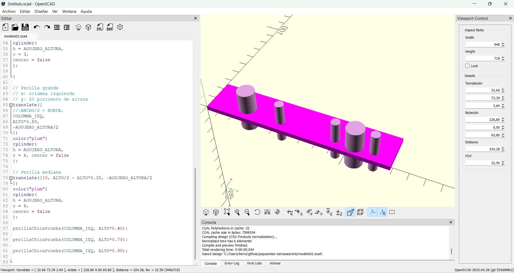
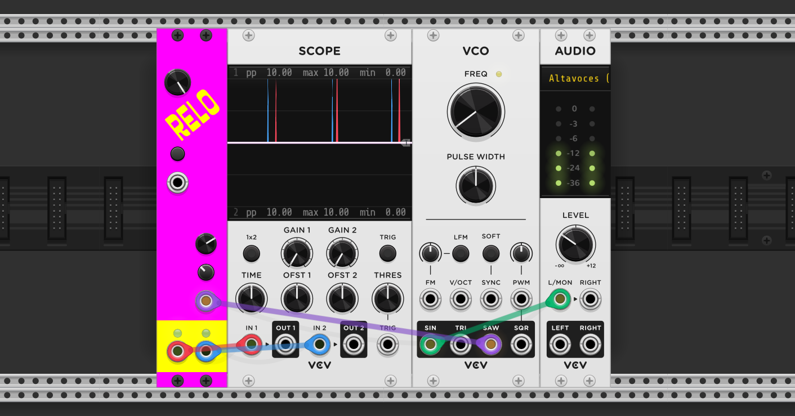
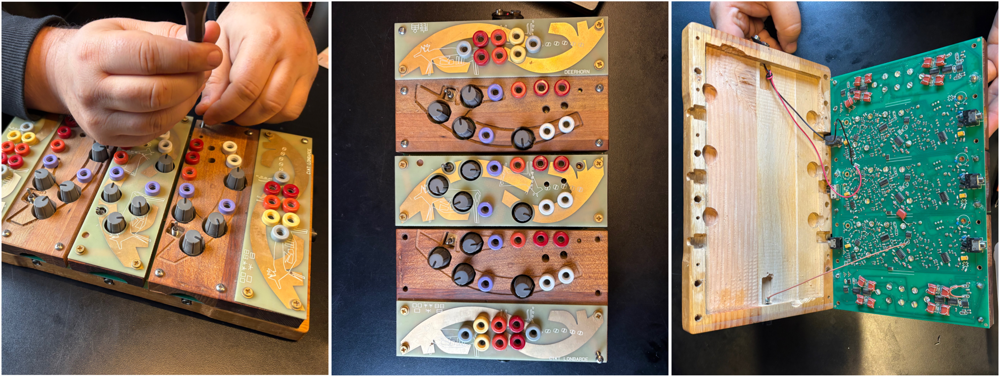
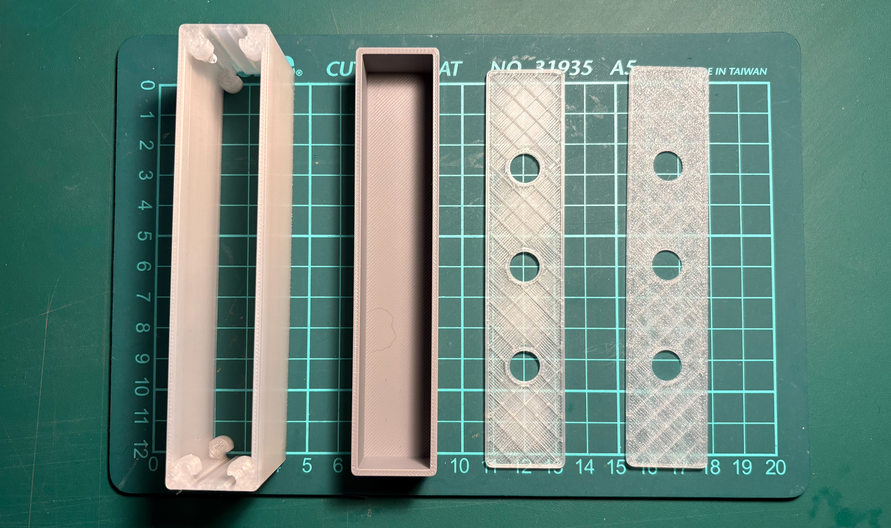

# Semana-02

## Resumen de días, temas y horas

| Fecha      | Día      | Temas                                                | Lugar     | Horas día / hora semana |
| :--------- | :------- | :--------------------------------------------------- | :-------- | :---------------------- |
| 2026-07-27 | Lunes    | git, planificación, carcasa, Eurorack                | Rep180    | 005 / 005               |
| 2026-07-28 | Martes   | git, carcasa, OpenScad, prototipos                   | LID       | 007 / 012               |
| 2026-07-30 | Jueves   | git, carcasa, OpenScad, prototipos                   | Casa      | 006 / 018               |
| 2026-07-31 | Viernes  | carcasa, OpenScad, prototipos                        | LID       | 004 / 022               |
| 2026-08-01 | Sábado   | lectura de tesis                                     | Casa      | 002 / 024               |

## Copia local

Primero hice un fork del repositorio de carcasas de los sintetizadores, el cual utilizaremos para trabajar con código en OpenSCAD.

El repositorio en el que estamos trabajando es: <https://github.com/piruetasxyz/popusintes-carcasas>.

La verdad, aún me ha costado acostumbrarme a trabajar desde la terminal. He cometido algunos errores, como subir apuntes sin hacer antes un **git pull** para actualizar mi repositorio local con los cambios que estaban en la nube.

## Diseño de carcasa

Para la carcasa tenemos dos elementos importantes: el módulo **rack**, que tiene su correspondiente PCB, y un panel donde van las perforaciones para las perillas, los tornillos y las entradas y salidas jack TS.

Revisamos algunas funciones de los sintetizadores para comprender sus posibles salidas y la interacción de Relo. Hoy comprendí en profundidad la propuesta de este módulo de sintetizador, en el cual se puede entender la referencia directa con DrumMachine.

Sistema autocontenido.

### Diseño paramétrico con OpenScad

Vamos a utilizar OpenSCAD para modelar desde un archivo de **script**. A diferencia de Rhino, en donde el modelado se realiza de forma directa y puedes interactuar con el modelo, en OpenSCAD el modelo se construye a partir de **código y parámetros editables**. Esto permite modificar las dimensiones y generar distintas versiones de una misma pieza sin tener que editarlas desde cero.

Además, OpenSCAD trabaja únicamente con **sólidos**, lo que permite generar modelos utilizables de forma tangible, a diferencia de otros programas en los que es posible modelar mallas sin volumen.

### Principales parámetros que debemos registrar

**Perforaciones:** perforaciones para perillas grandes y pequeñas, perforaciones para adherir el módulo al **skiff** Eurorack y perforaciones para las conexiones de las entradas jack TS.

El módulo **skiff** es donde se contienen los módulos en formato Eurorack. Es la caja donde se encajan las placas; todas están estandarizadas en cuanto a las perforaciones para los módulos, pero pueden variar en sus materiales, dimensiones e inclinaciones.

Estas perforaciones debemos construirlas como cilindros, cada uno con sus propias medidas. Estos cilindros se ubican desde el centro y se pueden posicionar mediante divisiones.

**Bases:** las bases de cualquier estructura, ya sea del módulo rack o de la carcasa, en donde después se realizarán las diferencias con las perforaciones y extrusiones, como el chaflán.

### Crear formas

En OpenSCAD tenemos tres formas principales: **cubos, cilindros y esferas**. Estas son las básicas con las que se construyen la mayoría de las formas; sin embargo, también existen otras herramientas, como los poliedros y las extrusiones, que permiten generar geometrías más complejas.

Con los cubos podemos crear trapecios modificando sus medidas. Con los cilindros es con lo que más podemos crear formas, ya que, si **modificamos la cantidad de caras**, más que la resolución de renderizado, como yo anteriormente lo había entendido, podemos obtener diferentes figuras.

Por ejemplo, se pueden seleccionar 3 caras para obtener un prisma triangular, 4 para un prisma cuadrado o aumentar la cantidad de caras para crear hexágonos y otras formas poligonales. Si uno de los radios del cilindro se reduce a 0, es posible obtener una pirámide o un cono, dependiendo de la cantidad de caras seleccionadas.

Con el comando color, escribiendo el color específico que quieras, puedes asignar un color a cada pieza. Esto lo voy a utilizar para distinguir mejor cada componente antes de realizar extrusiones o uniones. Los nombres de los colores se pueden encontrar en <https://htmlcolorcodes.com/es/nombres-de-los-colores/>.

#### Valores de medidas

Para darle medidas a nuestras formas debemos asignarles parámetros. Por ejemplo en un cilindro utilizamos **h** para definir la altura y **r** para definir el radio. Estos valores se expresan en milímetros y pueden modificarse en cualquier momento, permitiendo cambiar las dimensiones de la pieza sin tener que volver a modelarla.

Dependiendo de la figura, OpenSCAD utiliza distintos parámetros. Por ejemplo, un cubo utiliza el tamaño de sus lados **(size)**, mientras que un cilindro utiliza la altura **(h)** y el radio **(r o r1 y r2 si los radios son diferentes)**.

#### Desplazar y referenciar ubicación

Con el comando **translate()** podemos desplazar una figura dentro del espacio. La ubicación se define mediante los ejes **x**, **y** y **z**, indicando cuánto se moverá la pieza en cada dirección. También podemos referenciar posiciones a partir de divisiones o medidas en relación con otras piezas.

#### Módulo PCB Eurorack Relo

Me instalé VCV Rack para poder explorar el módulo de Relo. Este sintetizador cuenta con dos osciladores y tres perillas: una para controlar el oscilador, otra para la desincronización entre ambos osciladores y una tercera para ajustarla. Además, tiene un botón que los sincroniza y dos entradas y dos salidas tipo jack TS.

todas las entradas estan arriba, todas las salidas estan abajo.

<https://library.vcvrack.com/piruetas-popusintes/relo>

### Materialidad de la carcasa

Para la materialidad de **Relo**, tenemos dos principales materiales con sus respectivos procesos. En mi opinión, una de nuestras mejores opciones sería utilizar madera mecanizada, ya que en la universidad contamos con una máquina CNC que funciona mediante código y que me permitiría profundizar en esta herramienta. Este es un proceso de sustracción, y me atrevo a decir que, si decidimos utilizar este material, podemos realizar carcasas solo con madera de rescate, ya que no son carcasas muy grandes.

Esta carcasa debe seguir una lógica de caja: debe poder abrirse, montarse y desmontarse. Para ello, deberíamos utilizar herrajes, tornillos e insertos. La madera es un material muy provechoso, ya que se puede grabar, impermeabilizar, enlacar, pintar, prensar, entre otros procesos.

Para los prototipos de esta carcasa, definitivamente vamos a utilizar impresión 3D, con el fin de imprimir pruebas de la misma PCB de **Relo**. Para esto utilizaré la impresora 3D **Bambu Lab**.

#### Pruebas materiales

Como primera prueba de OpenSCAD y de la materialidad, imprimimos un diseño estándar de una PCB en formato Eurorack utilizando PLA en la impresora 3D Bambu Lab. Este primer testeo nos permitió visualizar un resultado físico del modelo, comprobar las uniones y evaluar posibles ajustes.

