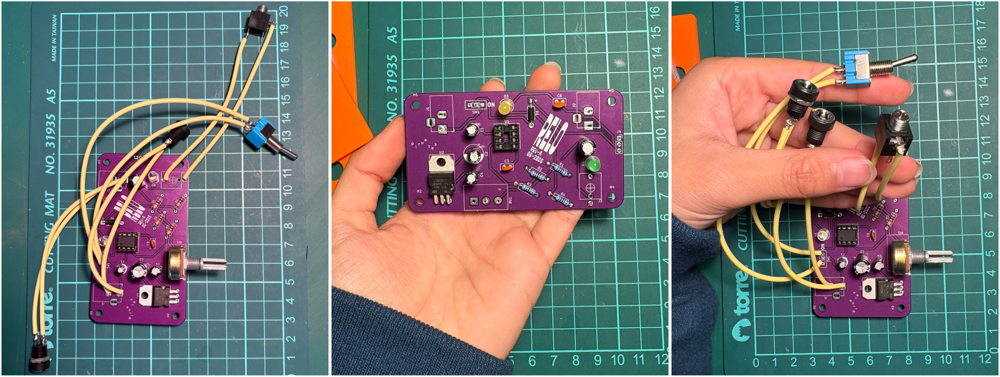
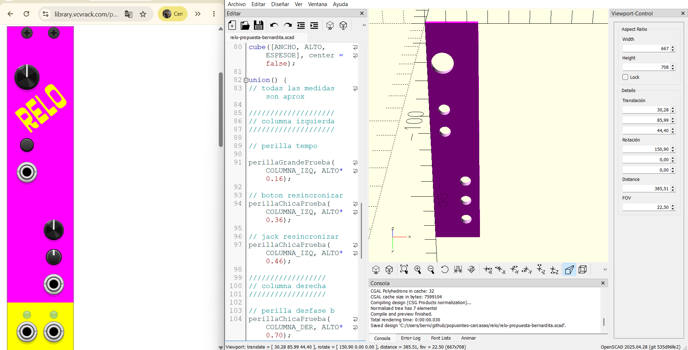
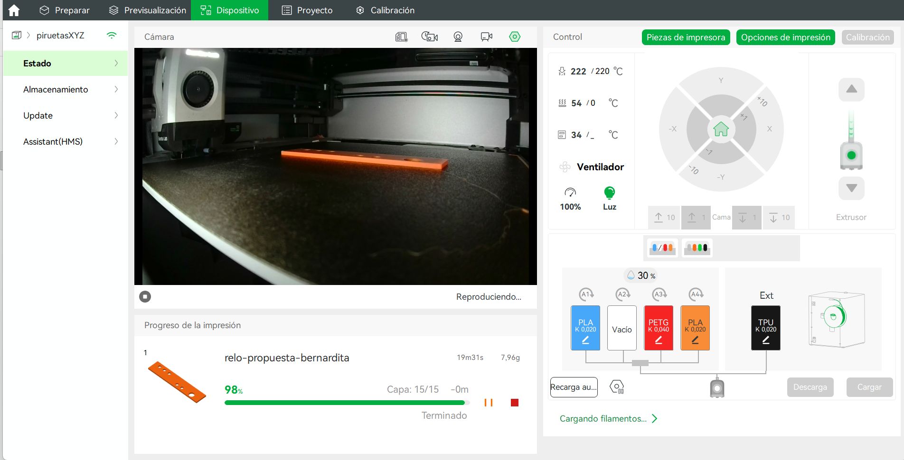
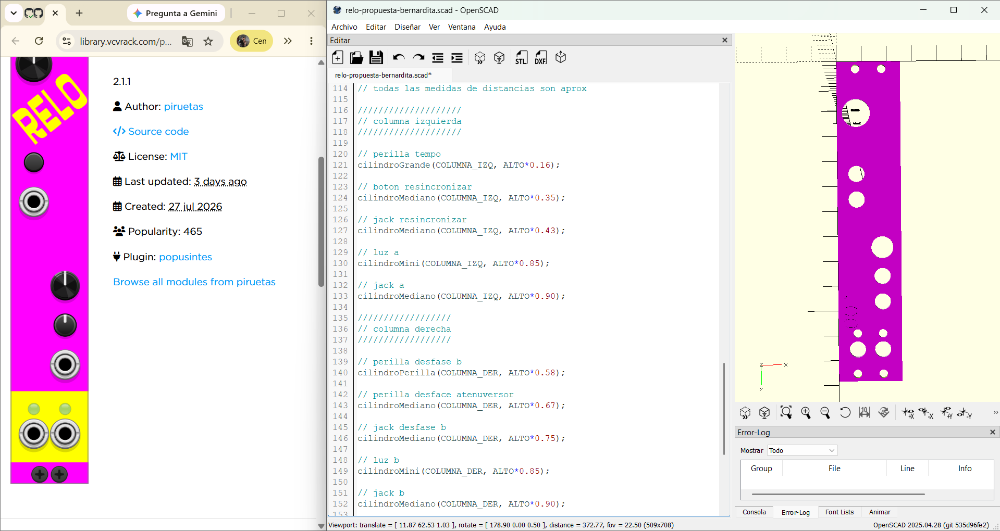

# Semana-03

## Resumen de días, temas y horas

| Fecha      | Día      | Temas                                                | Lugar     | Horas día / hora semana |
| :--------- | :------- | :--------------------------------------------------- | :-------- | :---------------------- |
| 2026-08-03 | Lunes    | planificación, carcasa, Eurorack                     | LID       | 007 / 007               |
| 2026-08-04 | Martes   | planificación, lectura tesis                         | LID       | 006 / 014               |
| 2026-08-06 | Jueves   | git, OpenScad, impresión 3d                          | Casa      | 008 / 022               |

## Desarrollo general

esta semana fue de..

[Canción Cajas y Paneles](https://open.spotify.com/track/2u25nSWGGJX8sIOAHxgFvD)

## Popusintesíntesis

Mediante la lectura de este borrador a la candidatura del proyecto de tesis, comprendí el fin y el planteamiento de esta tesis, que busca, a nivel cultural, popularizar la síntesis, dándole el valor material situado, **software** y **hardware** de fuente abierta y a bajo costo.

Me hizo mucho sentido con la tesis el valor que le estamos dando al modelado 3D con código, no solo para poder hacerlo escalable, lo cual me parece una promesa muy bella, sino también tomar la responsabilidad de hacer proyectos replicables, que se puedan modificar y potenciar; la **permacomputación** como lo contrario de la obsolescencia programada, pura resistencia.

Hundred Rabbits, viajeros en barco que practican la permacomputación, modificando y arreglando su barco.

Utilizar un elemento como lo son los sintetizadores como un **instrumento pedagógico**. Comprendo el valor de la documentación de esta práctica y voy a darle más importancia. Creo que la elección de las palabras para describir las cosas es crucial, y me parece importante enfatizar el lenguaje para describirlas y poder conversarlas en diferentes contextos, como lo pueden hacer personas que se dediquen a la síntesis, académicos o personas a las que solo les gusten los ruidos y tengan el interés.

Recuerdo una clase de mi diplomado de medio ambiente donde hablamos de la parálisis climática, que es cuando el problema que se presenta parece tan complejo que **te inmoviliza a no actuar**. Yo creo que lo mismo puede ocurrir cuando te enfrentas a una disciplina o práctica desconocida. Por eso me parece bonito ese primer acercamiento, y si ese acercamiento debe tener su propio lenguaje formal, simbólico y material.

Esto se menciona en la necesidad de crear un **glosario**, inciso de la tesis.

Como movilizante está la **democratización del acceso a la síntesis sonora**, que es algo que esta tesis practica al eliminar software de pago y realizar investigaciones en español. A mí me surgía la duda de cómo alguien que no viene de un contexto social o familiar en donde haya crecido con la cultura y la escucha musical puede involucrarse o profesionalizarse; es una búsqueda y un temor personal.

Por eso estoy realmente fascinada con la idea de facilitar el acceso a hacer ruido y aprender de síntesis, ya que, a veces, solo conocer las posibilidades de aprendizaje puede llegar a ser un privilegio.

Esto responde a una de sus inquietudes, la cual es comprender y potenciar las capacidades artísticas locales, popularizar la **producción de ruido con fines artísticos**, salir de los paradigmas hegemónicos de la música, como los armónicos, las melodías y las escalas musicales, entendiendo que estos son medios para categorizar; y dar valor a la experimentación.

Esto sí se percibe como una **práctica de taller**, en donde, en una primera instancia de esta tesis, ese taller se resuelve en nuestros computadores con VCV Rack, el cual es gratuito y muy ameno de navegar.

Comprendo que al publicar en **VCV Rack** se busca la **popularización y generar discusión sobre la síntesis** y sus estrategias, que vienen de metáforas y conceptos. Crear las herramientas y bibliotecas como sedimentos para el desarrollo artístico.

La razón de desarrollar las carcasas de forma paramétrica no solo es la optimización, sino tener la opción de utilizar otros módulos **rack** que convivan con Popusintes.

Conversando con Aarón sobre mis alcances de este borrador de tesis, una idea que surge de Aarón para un futuro proyecto podría venir de los **platillos de cueca chora**, ya que usarlos los destruye; la metáfora de esa fragilidad, referencia de Petter Blasser, sin interés en la pretensión de la precisión y la rapidez.

Consulté algunas dudas de la tesis, como el cronograma a largo plazo, ya que el próximo semestre también contempla una etapa de testeo de módulos.

## Carcasa

**Para la carcasa**, definí que existen distintos términos y propuestas, por lo que es necesario hacer una separación entre sus componentes. En este caso tendremos las **PCB**, los **paneles** y las **cajas**, que para este proyecto nombraremos como **botes**.

**PCB:** Se entienden como las placas electrónicas con sus componentes. Sus dimensiones y distribución, por el momento, están sujetas a cambios.

**Paneles:** Los paneles son la parte visible del módulo, es decir, la superficie con la que el usuario interactúa. Corresponden a la carcasa frontal que cubre la PCB y donde se montan las perillas, entradas y salidas, además de las perforaciones para tornillos y LED. Sus medidas están estandarizadas y seguirán el formato Eurorack (compatible con VCV Rack como referencia de diseño). El largo se mantiene fijo, mientras que el ancho puede variar en múltiplos de una medida estándar.

**Bote:** El bote corresponde a la caja o estructura del módulo Eurorack tipo *skiff*, que sostiene los paneles. Es una caja con perforaciones que permiten fijar los paneles mediante tornillos. Estos botes pueden fabricarse en distintos materiales. Mi propuesta es modelarlos con un espesor adecuado para ser cortados en CNC e incorporar posteriormente rieles o insertos compatibles con el estándar Eurorack.

En la siguiente fotografía se pueden ver las pruebas que imprimí la semana pasada. Las dos primeras piezas corresponden a los botes y las dos siguientes son los paneles.


En la siguiente fotografía se puede ver la PCB de la primera versión de Relo, antes de ser diseñada en formato Eurorack.



### Panel Eurorack Relo

Como estuve revisando la semana pasada, con OpenSCAD voy a modelar el panel donde irán las perforaciones para las perillas, los tornillos y las entradas y salidas **jack TS**. La disposición será con todas las entradas en la parte superior y todas las salidas en la parte inferior. Además, la distribución de los elementos será asimétrica, con el fin de dar mayor distancia entre ellos y facilitar su reconocimiento según su ubicación.

Para este modelado me guié por el panel publicado en VCV Rack:

[VCV Rack Relo](https://library.vcvrack.com/piruetas-popusintes/relo)

Creé tres tipos de cilindros, los cuales debo restar al sólido base del panel mediante una operación de diferencia (*difference()*). A cada tipo de cilindro le asigné sus correspondientes medidas. Esta fue una manera de optimizar el modelado, ya que solo existen tres tipos de perforaciones.

A todos los cilindros les di una altura suficiente para que sobrepasaran el espesor del panel y así pudieran generar correctamente las perforaciones al aplicar la operación de diferencia. Lo único que varía entre ellos es el radio de cada cilindro.

```openscad
// perillaChica
module perillaChicaPrueba(x, y) {

translate([x, y, -AGUJERO_ALTURA/2])
color("plum")
cylinder(
h = AGUJERO_ALTURA,
r = 3,
center = false
);

}

// perillaMediana
module perillaMedianaPrueba(x, y) {

translate([x, y, -AGUJERO_ALTURA/2])
color("plum")
cylinder(
h = AGUJERO_ALTURA,
r = 4,5,
center = false
);

}

// perillaGrande
module perillaGrandePrueba(x, y) {

translate([x, y, -AGUJERO_ALTURA/2])
color("plum")
cylinder(
h = AGUJERO_ALTURA,
r = 5.6,
center = false
);

}
```

Luego creé dos ejes, un eje izquierdo y un eje derecho, los cuales sirvieron como una grilla de referencia para posicionar los elementos según las referencias definidas anteriormente. De esta manera, fue posible mantener una distribución consistente y controlar la ubicación de cada perforación durante el modelado.

```openscad
// columnas
COLUMNA_IZQ = ANCHO * 0.30;
COLUMNA_DER = ANCHO * 0.70;
```



#### Prueba de material

Para ir entendiendo el flujo de trabajo, imprimí una prueba en PLA. Esto me ayudó a realizar el ejercicio de guardar el archivo de OpenSCAD y convertirlo en un archivo .STL.

En OpenSCAD es necesario renderizar el modelo antes de generar el archivo .STL y hacerlo antes de guardarlo, para asegurar que la versión exportada esté actualizada.

Con la impresión ya lista, me di cuenta de que el grosor para la prueba era demasiado, por lo que le reduje 1 mm. Para esta prueba no tenía las medidas reales de las tolerancias que iba a necesitar, pero sí me dio una mejor percepción de las dimensiones. Además, como OpenSCAD no tiene una unidad de medida definida, tenía la duda de cómo se exportaría el modelo.

Para esta prueba se tardó 19 minutos en imprimir en la Bambu Lab y se utilizaron 8 g de filamento PLA Basic de Bambu Lab.



Agregar foto de el prototipo**

#### Listado de elementos:

```openscad
// Panel centrado

// todas las medidas son aprox

////////////////////
// columna izquierda
////////////////////

// perilla tempo

// boton resincronizar

// jack resincronizar

//////////////////
// columna derecha
//////////////////

// perilla desfase b

// perilla desface atenuversor

// jack desfase b

//////////////////
// salidas
//////////////////

// luz a

// jack a

// luz b

// jack b
```

Ahora definí cuatro tipos de cilindros y corregí las medidas de los radios, de acuerdo con las tolerancias que se necesitan para cada perforación.

El cilindro mediano estaba construido para las perforaciones de las entradas Jack TS, pero es la misma medida que se requiere para las perforaciones del **botón de resincronización** y de la **perilla del desfase atenuversor**.

```openscad
// cilindro pequeño leds
module cilindroMini(x, y) {

translate([x, y, -AGUJERO_ALTURA/2])
color("plum")
cylinder(
h = AGUJERO_ALTURA,
r = 1.7,
center = false
);

}

// cilindro mediana para jacks ts
module cilindroMediano(x, y) {

translate([x, y, -AGUJERO_ALTURA/2])
color("plum")
cylinder(
h = AGUJERO_ALTURA,
r = 3.25,
center = false
);

}

// cilindro pequeña para botones
module cilindroPerilla(x, y) {

translate([x, y, -AGUJERO_ALTURA/2])
color("plum")
cylinder(
h = AGUJERO_ALTURA,
r = 4.4,
center = false
);

}

// cilindro grande para perilla
module cilindroGrande(x, y) {

translate([x, y, -AGUJERO_ALTURA/2])
color("plum")
cylinder(
h = AGUJERO_ALTURA,
r = 5.6,
center = false
);

}
```

Agregué parámetros para crear los agujeros donde van los pernos del bote. Estos no están referenciados a las columnas derecha e izquierda.

```openscad
////////////////////
// referencias de los pernos
////////////////////

// Distancia de los pernos respecto a los bordes del panel
MARGEN_X = 7.5;
MARGEN_Y = 3;

// Posición horizontal de los pernos
PERNO_IZQUIERDO = MARGEN_X;
PERNO_DERECHO = ANCHO - MARGEN_X;

// Posición vertical de los pernos
PERNO_SUPERIOR = ALTO - MARGEN_Y;
PERNO_INFERIOR = MARGEN_Y;

//////////////////////
// PERFORACIÓN PARA LOS PERNOS
//////////////////////

// Diámetro del agujero para el tornillo de montaje
DIAMETRO_PERNO = 3.4;

module agujero_perno() {
    cylinder(
        h = ESPESOR + 2,   // Atraviesa completamente el panel
        d = DIAMETRO_PERNO,
        $fn = 50
    );
}

////////////////////
// diferencias para los pernos
// no referenciados a las columnas
////////////////////

// Perno superior izquierdo
translate([PERNO_IZQUIERDO, PERNO_SUPERIOR, -1]) agujero_perno();

// Perno inferior izquierdo
translate([PERNO_IZQUIERDO, PERNO_INFERIOR, -1]) agujero_perno();

// Perno superior derecho
translate([PERNO_DERECHO, PERNO_SUPERIOR, -1]) agujero_perno();

// Perno inferior derecho
translate([PERNO_DERECHO, PERNO_INFERIOR, -1]) agujero_perno();

}

}
```

#### Primera propuesta de panel

Piruetas necesitaba ver avances concretos, por lo que tuve que modelar, o más bien, programar la primera propuesta del panel.

En la siguiente captura se muestra cómo, después de incorporar las nuevas medidas de todos los elementos y tomar como referencia el módulo desarrollado en VCV Rack, se obtiene esta primera propuesta del panel.



Para esta prueba se tardó 18 minutos en imprimir en la Bambu Lab y se utilizaron 7 g de filamento PLA Basic de Bambu Lab.

Agregar captura de bambulab**

Agregar foto de el primer prototipo**

incluir cotización hecha con una tabla de cuanto costaria el g de filmento con mas de una opción**


