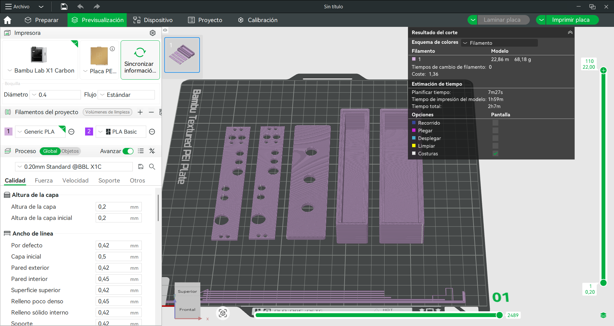
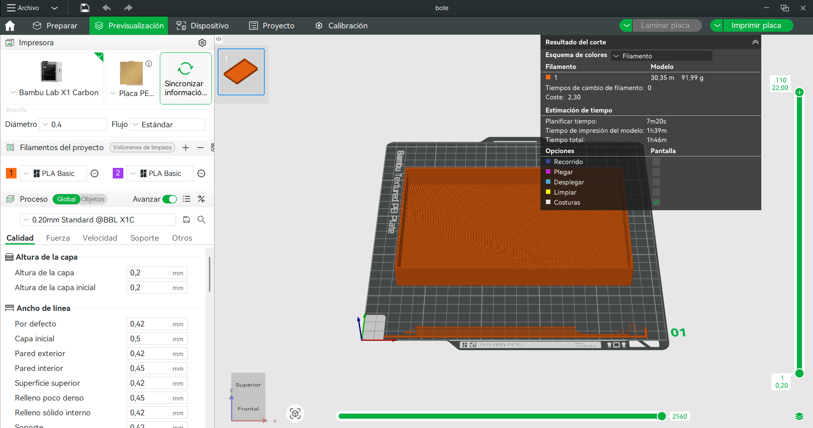
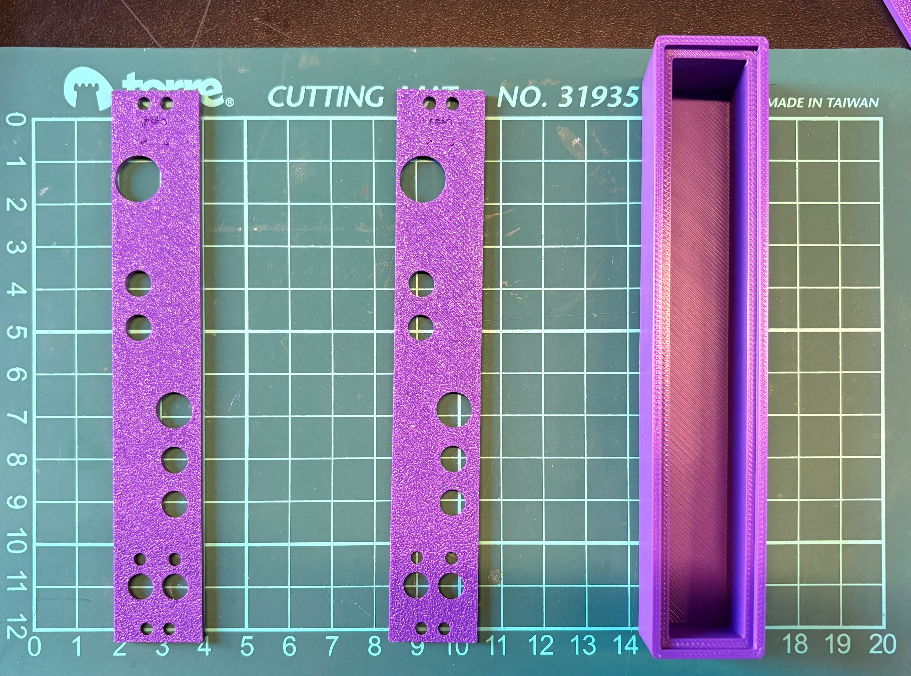
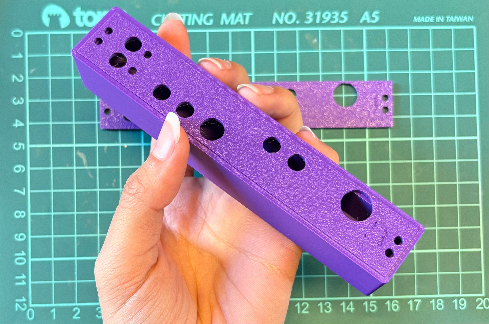
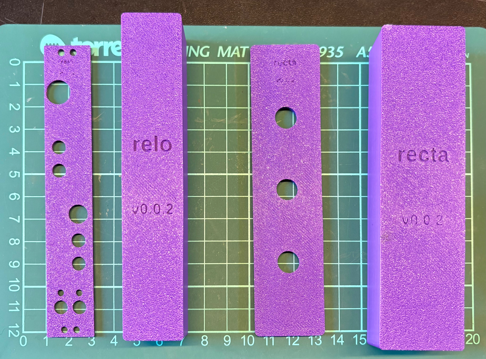

# Semana-05

| Fecha      | Día      | Temas                                                | Lugar     | Horas día / hora semana |
| :--------- | :------- | :--------------------------------------------------- | :-------- | :---------------------- |
| 2026-08-17 | Lunes    | planificación, OpenScad                              | LID       | 006 / 006               |
| 2026-08-18 | Martes   |                                                      | Casa      | 000 / 000               |

## Modelado de paneles y cajas

### Prueba de material

Tomamos los nuevos parámetros corregidos, con las medidas correctas de las perforaciones, y los distribuimos en las otras carpetas.

Con las nuevas versiones y las medidas ya corregidas, concluí que era necesario diversificar estos nuevos datos a los otros modelos. 

En la siguiente captura se puede ver el **slicer** de Bambu Lab, en donde preparé las piezas para imprimirlas. En este caso, no necesitaba soportes. De izquierda a derecha, primero tenemos dos piezas de paneles de Relo; luego, una pieza de panel de prueba; después, una caja de Relo, y la última es una caja de prueba. Estas piezas tardan **2 horas y 7 minutos** en imprimirse en la Bambu Lab X1 y se utilizaron **69 g de filamento PLA Basic**.

En la siguiente captura se puede ver el **slicer** de Bambu Lab, en donde preparé la pieza **Bote**, la cual tarda **1 hora y 46 minutos** en imprimirse en la Bambu Lab A1 y se utilizaron **92 g de filamento PLA Basic de Bambu Lab**.

Además, como mencioné la semana pasada, quise agregar un control de versiones, por lo que, en las pruebas de impresión en PLA, desde ahora siempre se imprimirá una extrusión de texto indicando la versión correspondiente.

agregar foto de las piezas donde se vea el numero de versión*

## Salidas

### Tránsitos perceptivos

Performance audiovisual de escucha colectiva, por Martin Gubbins y Noctilucente.

El martes 18 de agosto, fuimos junto a Aarón a una tocata en el Centro Cultural España, en el Salón Nube. Primero, yo no conocía este espacio; tenía varias obras expuestas, libros y diversas salas. Aquí es donde, en un futuro, residirá Biblioteca Cuir, para lo que Piruetas también está trabajando.

#### Ritual

Noctilucente presentó un video con sus sonidos de grabaciones junto a sintetizadores que controlaba con MIDI. Este video estaba proyectado y el salón estaba apagado. El video era una visualización del sonido, el cual conformaba, a lo largo del tema, un círculo construido por los datos de los sonidos. Las frecuencias dibujaban un círculo y esto te mantenía en constante observación.

#### Post tenebras lux

Martin Gubbins, junto a Noctilucente, presentó una performance donde su voz y sus poemas, narrados hacia un micrófono, eran intervenidos por diversos efectos de pedales. Era pura experimentación sonora, acompañada de Noctilucente, quien musicalizaba con sintetizadores y MIDI.

Al finalizar el evento, pude acercarme a preguntarle al artista que hizo las visualizaciones con qué las había realizado. Tenía la sospecha de que las había hecho con TouchDesigner, y así era. Me dijo que era un desarrollo simple; no profundizó en cómo vinculaba los datos de las pistas desde Ableton a TouchDesigner, pero me ayudó a ver opciones y el espectro de posibilidades que existe para visualizar sonido.

Me acerqué a Noctilucente y pude ver que utilizaba un Korg Minilogue y un controlador MIDI desde Ableton. Creo que debería atreverme a utilizar MIDI; esto me motivó.

### Reunión magister

### Lanzamiento del libro: La academia como creación

El jueves 20 de agosto, junto a Aarón, fuimos al lanzamiento del libro **La academia como creación**. Fue de hecho, también en el Centro Cultural España. El libro era una reflexión sobre la práctica creativa en la enseñanza, de la cual anoté:

Cuando haces una práctica iterativa, debes estar dispuesto a aprender de ese ejercicio en la repetición. No esperas un resultado; la iteración le da el valor, la iteración es la materialización.

Y tal vez no todos los ejercicios iterativos llegan a un proceso de curaduría final.

### Simposio de Literatura Comparada

El viernes 21 de agosto fui al último día del Simposio de Literatura Comparada, organizado por el Doctorado de Artes y Humanidades de IDEA USACH y el Magíster de Literatura Latinoamericana y Chilena de la USACH.

¿Qué ocurre cuando ponemos en diálogo distintas obras, lenguajes, tradiciones y formas de creación?

#### Poesía y performance

El último acto de este simposio partió con cuatro artistas y poetas narrando obras en las que habían estado trabajando. ... Fue el primero y recuerdo que mencionó que estaba trabajando con poemas en **sextina**, que tenía que ver con volver sobre las mismas palabras. Además, nos hizo participar de su narración, pidiéndonos que fuéramos repitiendo sus palabras o percutiendo otras. 

Luego, ... leyó una serie de poemas. Conecté mucho con lo que expresaba, me gustó que utilizara lenguaje de texturas para profundizar y describir sus ideas. 

Y por último, Felipe Cussen, quien me sorprendió con su propuesta, sobre todo porque comenzó hablando y rápidamente el lenguaje se convirtió en una serie de sonidos difusos y latentes.

#### Ensamble místico

Para cerrar este simposio, se presentó Ensamble Místico, compuesto por Noctilucente, Tarix, María José Parga y Aarón.

Esta performance era una combinación de diferentes manifestaciones sonoras. En un principio sonaba un piezo por Aarón, acompañado de sonidos grabados en un Volca Korg por Tarix y el Minilogue Korg modulado por Noctilucente. De repente, María José Parga comenzó a leer un poema y su voz se dispersaba. Me impresionó su interpretación, tiene una voz muy bella y potente, y no me esperaba que utilizara un megáfono. Eso estuvo fascinante el conjunto de sonidos.

Rescato de estos eventos, que por cierto, muchas gracias Aarón por la invitación; de lo que tuve la oportunidad de conversar, que me parece muy bonito y esperanzador ver cómo a estos eventos participan personas, se dan el tiempo y dedican atención activa a escuchar poesía, propuestas o proyectos. Me parece un acto muy bello y humilde escuchar al otro. Puede sonar algo muy mínimo, pero la verdad, creo que tiene un enorme valor apoyar y celebrar el trabajo de los demás.

Esta es una de las razones por las que pretendo dedicarme a la academia y por lo que, además, me parece muy bello un proyecto como con el que estoy apoyando a Aarón; hacer las cosas más populares, abrir estos espacios a más personas, crear instancias para compartir conocimientos y discutir ideas; porque de esos espacios llenos de sensibilidad y de ese apoyo surgen cosas bonitas.

Citando a Felipe Cussen: “[…] lo hicimos para ejercer lo que aprendimos: leer, escribir, pensar, relacionar y crear, porque creemos que el conocimiento, la sensibilidad y la reflexión crítica que desde allí generamos es nuestro mayor aporte a la sociedad […]”.

### Seudocódigo

