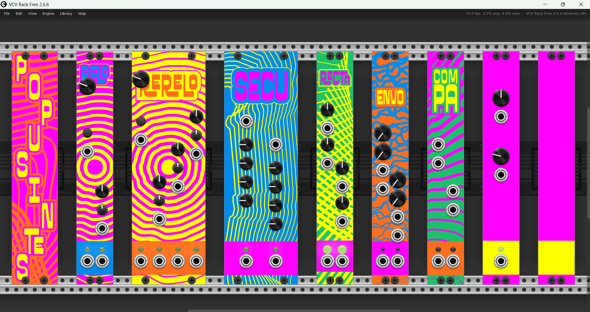
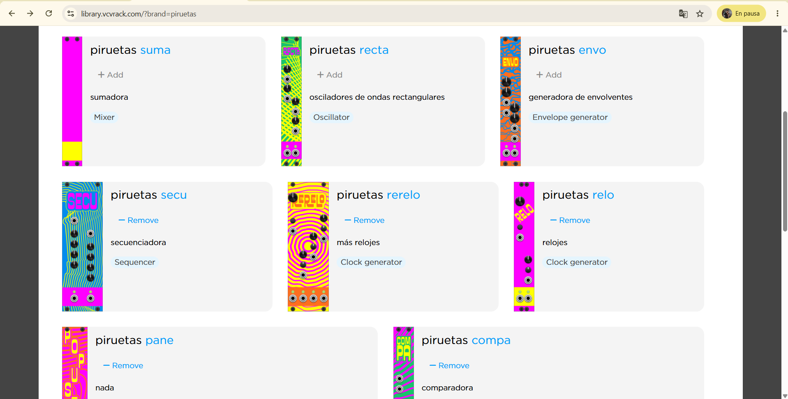
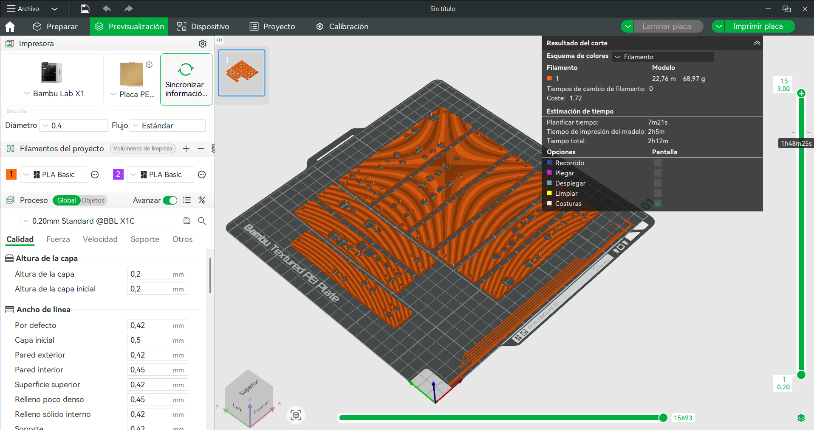
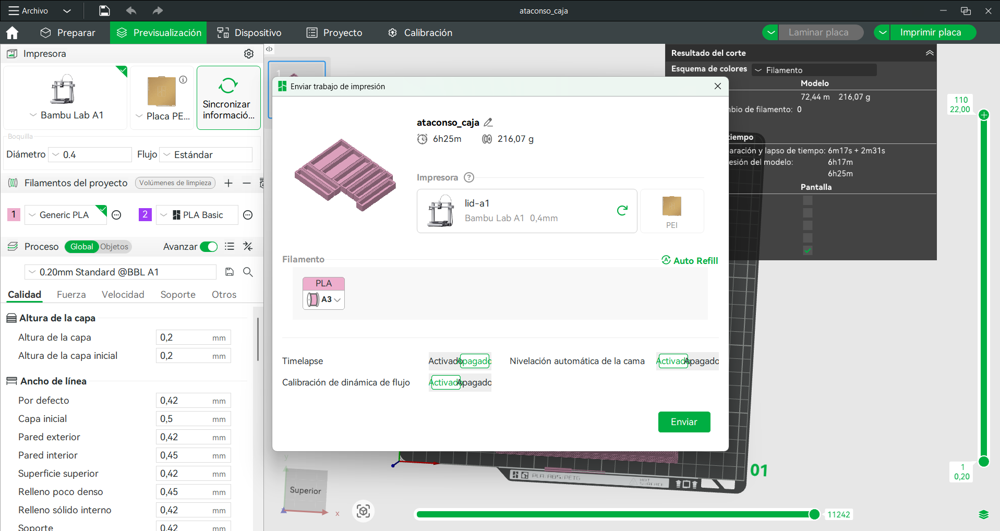
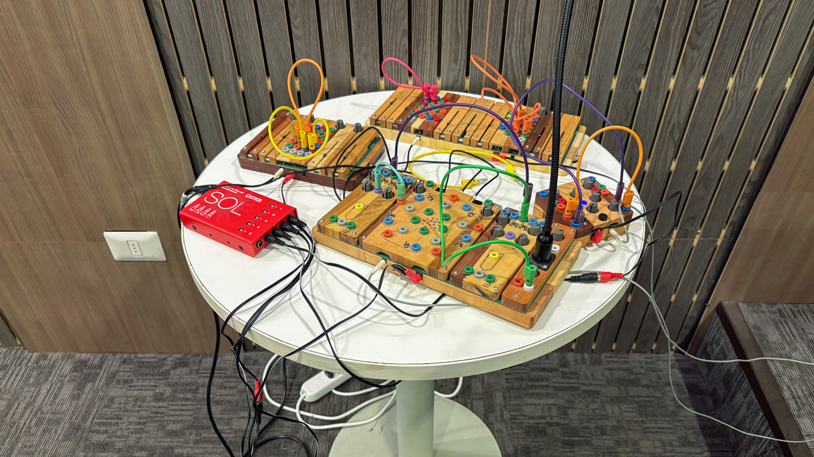
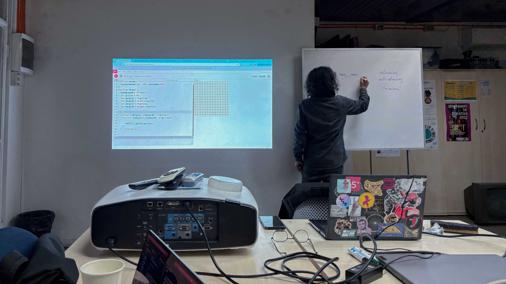
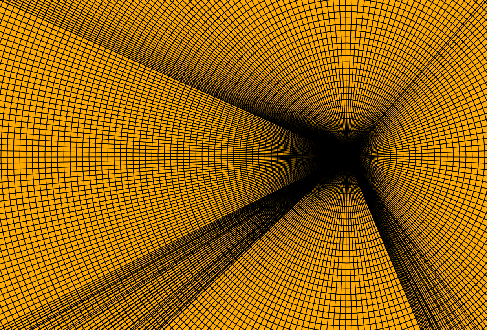

# Semana-06

| Fecha      | Día      | Temas                                                | Lugar     | Horas día / hora semana |
| :--------- | :------- | :--------------------------------------------------- | :-------- | :---------------------- |
| 2026-08-17 | Lunes    | planificación, VCV Rack, Prueba de sonido, Lanzamiento web | LID, USACH, Centro Cultural España | 008 / 008               |
| 2026-08-18 | Martes   | Charla, Popusintetizando                             | USACH      | 005 / 011               |
| 2026-08-19 | Miércoles | salida                                              | Casa      | 003 / 014               |
| 2026-08-20 | Jueves   | salida                                               | Casa      | 003 / 017               |
| 2026-08-21 | Viernes  | salida, GitHub, edición                              | Casa      | 005 / 022               |

## VCV Rack

### Copia local

Con la copia local que realicé la semana pasada de VCV Rack, quise abrir los **módulos actualizados de los Popusintes**. Por lo que entré a la aplicación de VCV Rack, pero estos no estaban actualizados.

Ahora entiendo que nunca voy a poder abrir la aplicación directamente y ver las versiones que todavía no han sido subidas y aprobadas por VCV Rack. Estas versiones existen en una **copia local remota**, la cual solo se puede abrir desde la terminal.

Para actualizar y compilar los módulos, primero entré a la carpeta de VCV Rack y luego a la carpeta del plugin de Popusintes. Desde ahí realicé un **git pull** para actualizar la copia local.

Luego utilicé **make dep** para revisar las dependencias y **make** para compilar el módulo. Al intentar escribir **male dist** apareció un error porque escribí **male** en lugar de **make**. Finalmente, comencé correctamente **make dist**, lo que generó el archivo **.vcvplugin** de la versión 2.1.1 para Windows.

```bash
berni@Dita MINGW64 /c/Users/berni/github

$ cd /c/Users/berni/github/

$ ls

2026-practica-bernardita-jesus  Rack  popusintes-cajas-paneles

$ cd Rack/

$ cd plugins/

$ cd popusintes-rack/

$ git pull

$ make dep

make: Nothing to be done for 'dep'.

$ make

$ male dist

-bash: male: command not found

$ make dist

rm -rf dist

mkdir -p dist/piruetas-popusintes

cp plugin.dll dist/piruetas-popusintes/

strip -s dist/piruetas-popusintes/plugin.dll

cp -r --parents LICENSE res plugin.json dist/piruetas-popusintes/

cd dist && tar --no-xattrs -c piruetas-popusintes | zstd -19 -o "piruetas-popusintes"-"2.1.1"-win-x64.vcvplugin

/*stdin* : 32.51% (550 KiB => 179 KiB, piruetas-popusintes-2.1.1-win-x64.vcvplugin)
```

### Comando para abrir VCV Rack

Una vez **actualizado y compilado el módulo**, para abrir VCV Rack utilizando la copia local, debo hacerlo desde la **terminal**, entrando primero a la carpeta de VCV Rack y comenzar el programa.

El comando final que debo utilizar es:

```bash
cd /c/Users/berni/github/Rack
./Rack.exe
```

De esta manera puedo abrir VCV Rack desde la copia local y trabajar con los módulos que estoy desarrollando, incluso si todavía no han sido publicados o aprobados en la biblioteca de VCV Rack.

### Ajustes y correcciones de los módulos

Recta y Embo tenían el tamaño de los LED diferentes, por lo que Aaron corrigió en el código esas medidas para tomarlas en relación con el módulo Combo, con LED de tamaño mediano.

Esto fue lo que me dio la oportunidad de aprender a actualizar los cambios y hacer **git pull**, lo que anteriormente registré.

En la siguiente captura se pueden ver los **módulos de la copia local remota en VCV Rack**. Aquí se puede percibir el error en el tamaño de los LED y algunas dimensiones de las gráficas que estamos dilucidando si mejorar, como el rectángulo rosa de Recta, que comienza un poco más arriba.



Los cambios de los LED, además de las perforaciones de los módulos más angostos, fueron algunos de los alcances que tomó Aaron y corrigió en el código.

Los cambios que habrá que hacer respecto de las gráficas los verá Mateo.

### Módulos actualizados publicados

Los cambios que se hicieron a los módulos fueron publicados y aprobados por VCV Rack, lo que significa que ahora se pueden ver las nuevas gráficas y algunas de las correcciones que se realizaron en el código.

En la siguiente captura se puede ver la última versión que ahora está subida a VCV Rack, a la que todos pueden acceder y agregar.



### SemVer

Versionamiento semántico.

El último número de versión corresponde a correcciones de errores, el siguiente a mejoras y el primero a un cambio radical.

VCV Library, en donde se van subiendo los archivos de todas las personas a Issues.

## Paneles

A medida que fuimos corrigiendo las medidas en el código, Aaron optimizó los códigos, **estableciendo referencias generales**. Estas medidas se utilizaron para crear nuevos códigos para el modelado de los paneles.

Por lo que, durante la semana, imprimí todos estos paneles con sus respectivas cajas.





Estas corresponden a la versión **v0.0.4**. Todas formarán parte de esta versión, independientemente de que solo se edite un panel. Es un **sistema versionado en conjunto**. De todas maneras, esto me hace sentido, porque en VCV Rack todos los módulos se actualizan al unísono.

Añadir fotos de los paneles impresos en 3D*

### Propuestas de mejora de paneles

Principales cambios:

Los cilindros más grandes **sobrepasan los bordes del rectángulo**. Algunas opciones para solucionar esto serían **aumentar la distancia** entre los elementos y reducir los márgenes y las columnas, agrandar los rectángulos para **darles más margen** o buscar **otras opciones de perillas**.

No he probado esa perilla en particular, pero, ya que nos vamos encontrando con estos conflictos, creo que la próxima semana debería **enfocarme en probar estos elementos para buscar soluciones desde lo concreto**.

Las perforaciones con las que se apernan los paneles a las cajas y botes deberían tener un poco más de tolerancia. Probaría con una tolerancia de 0,1 mm.

## Salidas

### Popusintetizando en USACH

El lunes 24 de agosto fuimos a una prueba de sonido para una charla en la que invitaron a Aarón a participar. La charla era (agregar información después). Fuimos a la universidad con los sintetizadores que organizamos el jueves, además de amplificadores, cables, transformadores y mixers.

El martes 25 de agosto fui como **apoyo técnico de backline**. Por cierto, no conocía este concepto, pero fue más o menos el rol que cumplí. Esto quiere decir **preparar, montar, mantener y guardar los instrumentos y equipos de los músicos**.

Lo presentado fue un éxito total. Había muchas autoridades de la USACH. Fue un chiste muy extraño, pero muy interesante, en el que tuvimos la oportunidad de participar.



Además de esto, el miércoles 26 de agisto, Aarón me encargó **preparar una serie de elementos** para realizar una clase de reemplazo del Mati en la Universidad de Chile. Seguí las indicaciones al pie de la letra; debía **llevar todos los sintetizadores con su equipamiento** completo para poder utilizarlos durante la clase.

### Lanzamiento web Biblioteca Cuir

El lunes 24 de agosto, en el **Centro Cultural de España**, fue el lanzamiento del libro ***Todo lo que cabe aquí***, de **Biblioteca Cuir**, y de su **web** que Piruetas estuvo desarrollando durante los últimos meses.

El evento estuvo muy bello. La **recopilación de registros** de su trabajo se sentía viva y llena de sensibilidad; se notaba que estaba hecha con mucho cariño. Creo que es una **linda manera de resistir**.

Además, el ambiente estuvo increíble, todos estaban muy felices y orgullosos por los lanzamientos.

A esto se suma la web, cuya propuesta me fascinó. La manera en que estaban dispuestas las publicaciones hacía que fuera **fácil de navegar** y, al mismo tiempo, **muy divertida de recorrer**.

agreagr fotos*

agregar link de la web*

### Clase de efectos visuales y formas

El día jueves 27 de agosto asistí a una **clase del Magíster en Artes Mediales** de la Universidad de Chile, impartida por el profesor **Christian Oyarzún**. La clase estuvo enfocada en la creación de gráficas algorítmicas, efectos visuales y formas mediante programación en p5.js.



#### Gráficas algorítmicas

Durante la clase trabajamos con **Sofwave**, una herramienta para crear visuales e imágenes basadas en algoritmos y geometría analítica.

Esta forma de trabajar se relaciona con el diseño paramétrico que estoy desarrollando en OpenSCAD, ya que en ambos casos se utilizan reglas, variables y fórmulas matemáticas para construir formas. Al modificar una variable o un dato numérico, las formas pueden cambiar automáticamente de acuerdo con las relaciones establecidas.

También trabajamos con la condición **IF** y con valores **booleanos**, que permiten establecer dos estados y tomar decisiones dentro del código.

#### Operadores lógicos

Los operadores lógicos permiten establecer instrucciones y relaciones dentro del código. En JavaScript, los principales son:

- **AND:** &&
- **OR:** ||
- **NOT:** !

También vimos otros conceptos relacionados, como **NAND** y **NOR**, que corresponden a operaciones derivadas de AND y OR.

Dentro de las funciones utilizadas en el código se encuentran:

- **translate:** permite trasladar un elemento y establecer su ubicación.
- **rotate:** permite rotar elementos.
- **push / pop:** permiten guardar y recuperar transformaciones dentro del código.
- **millis:** permite trabajar con el tiempo y generar cambios en función de este.
- **constrain:** permite establecer restricciones a los valores.

También se abordaron conceptos relacionados con la visualización digital, como **aliasing, antialiasing y moiré**.

#### map

La función **map** permite escalar valores y establecer una relación entre distintos rangos. Esto permite correlacionar un valor con otro y utilizarlo como referencia para modificar diferentes elementos dentro de una composición.

También vimos la lógica de construcción de una grilla a partir de dos funciones sinusoidales, donde las relaciones matemáticas permiten generar y modificar las formas de manera sistemática.



#### Referentes de gráficas algorítmicas

Algunos de los referentes revisados durante la clase fueron:

- Mark Wilson
- Vera Molnár
- Jean-Pierre Hébert
- Roman Verostko
- Victor Vasarely

Esta clase me ayudó a comprender de una manera más amplia el potencial de las matemáticas dentro del diseño. Al trabajar actualmente en el modelado de piezas 3D en OpenSCAD, he estado utilizando medidas, variables y relaciones entre elementos para construir objetos de manera paramétrica.

La clase me permitió reconocer que esta misma lógica puede aplicarse a otros medios, como las gráficas y los efectos visuales. Las matemáticas pueden convertirse en funciones, referencias y reglas capaces de generar formas y comportamientos de manera organizada.

Esto me ayudó a entender que el diseño paramétrico no se limita al modelado 3D, sino que puede ser una forma de pensar y construir: establecer reglas, relaciones y variables que permitan explorar diferentes resultados a partir de un mismo sistema.

