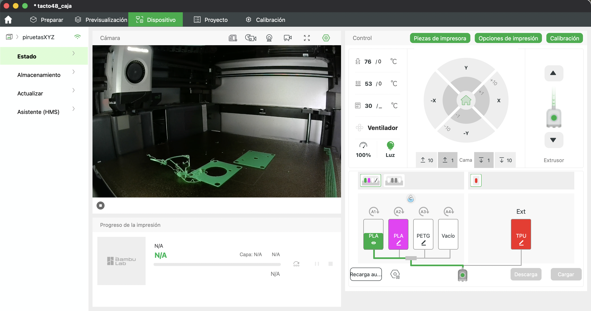
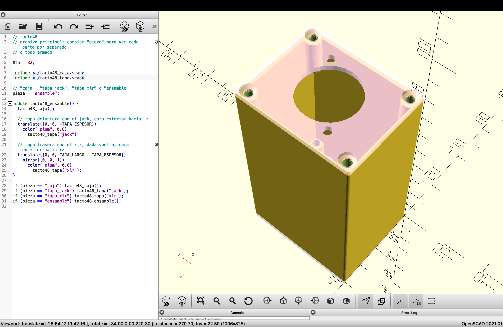

# Semana-10

## Resumen de días, temas y horas

| Fecha      | Día      | Temas                                                | Lugar     | Horas día / hora semana |
| :--------- | :------- | :--------------------------------------------------- | :-------- | :---------------------- |
| 2026-09-28 | Lunes    | GitHub, OpenSCAD, Impresión 3D                       | LID       | 009 / 009               |
| 2026-09-29 | Martes   | OpenSCAD, Impresión 3D                               | República 180 | 005 / 014               |
| 2026-10-01 | Jueves   |                                                      |           | 000 / 000               |
| 2026-10-02 | Viernes  |                                                      |           | 000 / 000               |
| 2026-10-03 | Sábado   |                                                      |           | 000 / 000               |
| 2026-10-04 | Domingo  | Documentación                                        | Casa      | 003 / 017               |

## Componentes

Fuimos a buscar a Pedro de Valdivia los componentes que llegaron de **[Thonk](https://www.thonk.co.uk/)** desde Inglaterra. Pedimos **fuentes de poder, perillas, potenciómetros, tornillos, golillas** y todos los componentes necesarios para poder seguir desarrollando los **Popusintes**.

## VCV Rack

Hacer copia de Popusíntesis.

## Tacto48

### Caja para amplificador piezoeléctrico

https://cults3d.com/es/modelo-3d/artilugios/1590a-pedal-case-enclosure-3d-printable

Hacer caja en impresión 3D que, por el momento, solo tiene:

- Entrada XLR.

- Salida para jack TS de 1/4" o de 1/8".

En la siguiente captura se puede ver la impresión de las tapas de la caja de **tacto48** desde la cámara de la Bambu Lab, en Bambu Studio.

En la siguiente captura se puede ver el código principal de **tacto48** en **OpenSCAD** y el ensamble de la caja con sus tapas.

https://audiosystemsmusic.cl/products/rea0024

https://www.cabezacuadrada.cl/product/jack-mono-gls/

https://www.cabezacuadrada.cl/product/jack-mono-cerrado/

El **Boss CH-2** es un pedal que cumple con el estándar de tener la **entrada a la derecha y la salida a la izquierda**.

Como ejemplo de amplificador piezoeléctrico está el **Drum Thing de Electro-Faustus**.

Mic condenser.

Preamp piezo.

https://audiosystemsmusic.cl/products/rea0024

https://www.katode.cl/busqueda

https://cults3d.com/es/modelo-3d/artilugios/1590a-pedal-case-enclosure-3d-printable
